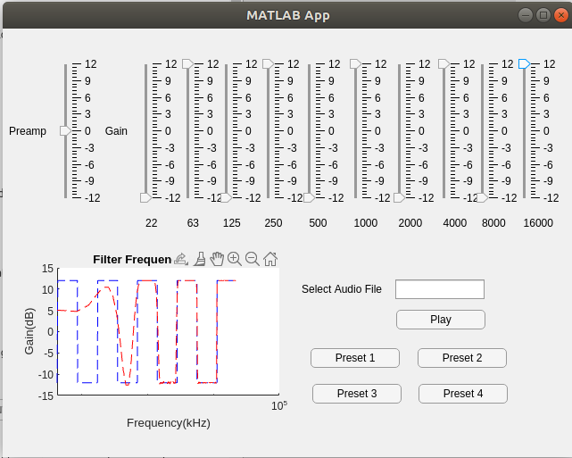

# AudioEqualizer

>This package is made for EE4413_Assignment_1 made by Kent Howard Geraldo U1820441B

This package contains an app that is capable of filtering audio file using a 512-tap FIR filter
## Preview

## Usage
To use the app run the following AudioEqualizer.exe file.  
To modify the app open the AudioEqualizer.mlapp file using MATLAB App Designer.  
To read the source code open the AudioEqualizer_exported.m file.  
